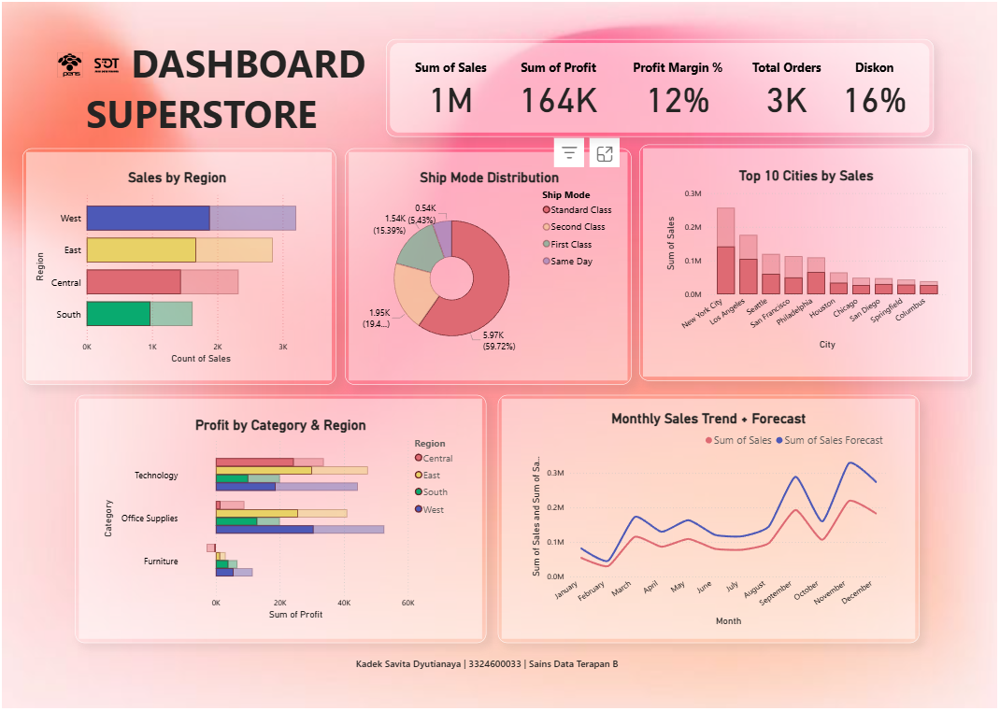

# Business Performance Dashboard – Superstore

## Project Description (English)
This repository contains a **business performance dashboard** created using **Power BI** based on the **Superstore dataset**. 
The dashboard provides a high-level overview of sales performance, profit, shipping patterns, and regional comparisons to support **quick business insight and presentation**.

## Deskripsi Proyek (Bahasa Indonesia)
Repository ini berisi dashboard **business performance analysis** yang dibuat menggunakan **Power BI** dengan **dataset Superstore**.  
Dashboard ini dirancang untuk memberikan gambaran singkat namun komprehensif mengenai performa penjualan dan profit perusahaan.

>>>

##‼️Important Note / Catatan Penting
This dashboard uses a **public sample dataset (Superstore)**. The project is intended **solely for educational and my learning process**.

Dashboard ini menggunakan **dataset sampel publik (Superstore)**. Proyek ini hanya digunakan untuk **tujuan pendidikan dan proses belajar saya**.

>>>

## Dashboard Objective
The main objective of this dashboard is to present a comprehensive snapshot of Superstore’s business performance, including:
- Overall sales and profitability
- Regional and city-level performance
- Shipping behavior
- Product category contribution
- Sales trends and forecasting

## Tujuan Dashboard
Dashboard ini membantu:
- Menyajikan KPI utama bisnis
- Mengidentifikasi wilayah dan kota dengan performa terbaik
- Memahami pola pengiriman pelanggan
- Menganalisis profit berdasarkan kategori produk
- Melihat tren penjualan bulanan dan proyeksi ke depan

>>>

## Key Performance Indicators (KPI)
The dashboard highlights five main KPIs:
- **Total Sales:** ~2 million  
- **Total Profit:** ~286 thousand  
- **Average Profit Margin:** ~12%  
- **Total Orders:** ~5,000  
- **Average Discount:** ~16%
These KPIs provide a quick summary of the overall business condition.

>>>

## Key Insights Summary

### 1️⃣ Sales by Region / Penjualan Berdasarkan Wilayah
The **West** region contributes the highest total sales, followed by **East, Central, and South**. This indicates that the West region has the strongest market presence and customer concentration.

Wilayah **West** menyumbang total penjualan tertinggi, diikuti oleh **East, Central, dan South**. Hal ini menunjukkan bahwa wilayah West memiliki kehadiran pasar yang paling kuat dan konsentrasi pelanggan yang tinggi.

>>>

### 2️⃣ Ship Mode Distribution / Distribusi Metode Pengiriman
Approximately **60% of orders use Standard Class shipping**, making it the most preferred delivery method. This suggests customers tend to choose more economical shipping options, while **Same Day** and **First Class** are used less frequently.

Sekitar **60% pesanan menggunakan pengiriman Kelas Standar**, menjadikannya metode pengiriman yang paling disukai. Hal ini menunjukkan pelanggan cenderung memilih opsi pengiriman yang lebih ekonomis, sedangkan **Same Day** dan **First Class** digunakan lebih jarang.

>>>

### 3️⃣ Top 10 Cities by Sales / 10 Kota Teratas Berdasarkan Penjualan
**New York City** records the highest sales, followed by **Los Angeles, Seattle, and San Francisco**. This insight can help prioritize inventory planning and marketing strategies in high-performing cities.

**New York City** mencatat penjualan tertinggi, diikuti oleh **Los Angeles, Seattle, dan San Francisco**. Wawasan ini dapat membantu memprioritaskan perencanaan persediaan dan strategi pemasaran di kota-kota dengan kinerja tinggi.

>>>

### 4️⃣ Profit by Category & Region / Laba per Kategori & Wilayah
**Office Supplies** generate the highest profit, especially in the **West** region.   In contrast, **Furniture** shows relatively lower profit, with some regions recording minimal or low profitability. This may indicate the need for pricing or cost strategy evaluation for the Furniture category.

**Office Supplies** menghasilkan laba tertinggi, terutama di wilayah **West**.   Sebaliknya, **Furniture** menunjukkan laba relatif lebih rendah, dengan beberapa wilayah mencatat laba minimal atau rendah. Hal ini mungkin menunjukkan kebutuhan untuk mengevaluasi strategi harga atau biaya untuk kategori Furniture.

>>>

### 5️⃣ Monthly Sales Trend & Forecast / Tren Penjualan Bulanan & Perkiraan
Sales show a noticeable increase from **September to November**, followed by a slight decline in December. The forecast suggests a similar seasonal pattern, indicating relatively stable growth toward the end of the year. This insight is useful for **inventory planning and promotional strategies**.

Penjualan menunjukkan peningkatan yang signifikan dari **September hingga November**, diikuti oleh penurunan ringan pada Desember. Perkiraan menunjukkan pola musiman serupa, menunjukkan pertumbuhan yang relatif stabil menjelang akhir tahun. Wawasan ini berguna untuk **perencanaan persediaan dan strategi promosi**

>>>

## Dashboard Preview

🔗 Interactive dashboard (view-only):

[https://app.powerbi.com/view?r=eyJrIjoiMTc3YjE4NDctNGRlNy00ODVkLWE1YTItZDM4MWNhMTM1MTRlIiwidCI6IjUxZDc5MGQ1LWJlZmItNDg0ZS04NmM2LWQxN2I2NDcyNzYyNCIsImMiOjEwfQ%3D%3D]

>>>

## Tools Used
- Power BI
- Superstore Sample Dataset

>>>

## Kesimpulan Singkat
Secara keseluruhan, dashboard ini memberikan insight yang jelas mengenai
kondisi bisnis Superstore, mulai dari performa penjualan, kontribusi wilayah,
hingga tren dan forecasting, sehingga dapat mendukung pengambilan keputusan
berbasis data.

>>>

## Author
Kadek Savita Dyutianaya

Applied Data Science Student

Politeknik Elektronika Negeri Surabaya (PENS)

